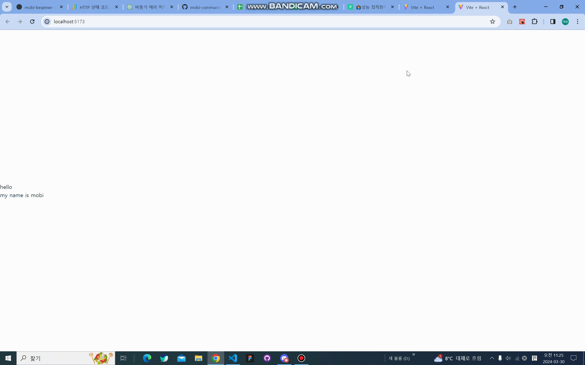
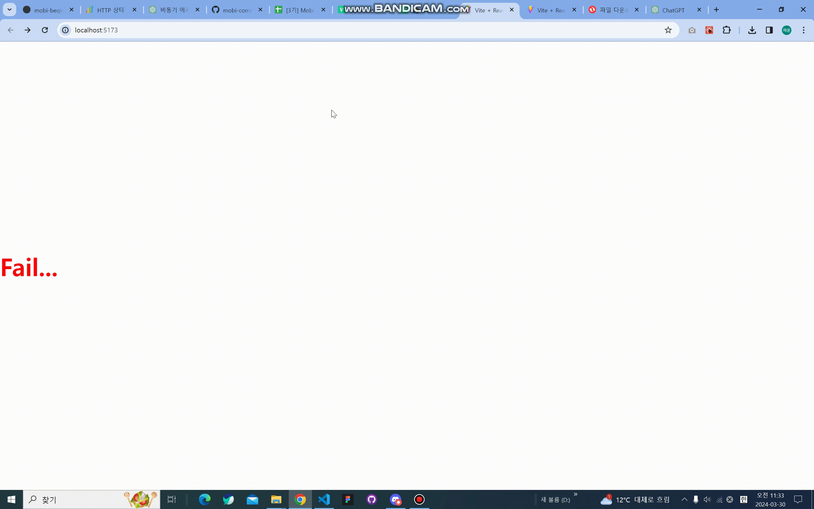

# Task 4 suspense 사용하기

## 과제 목표

suspense를 활용해서 부분적으로 render를 진행하는 것을 목표로 과제를 진행했습니다.

## 설계

### 1. promiseWrapper, delayhelper
promiseWrapper함수는 매개변수로 new Promise() 객체를 받도록 되어있습니다.

delayhelper함수에서는 매개변수로 세가지를 받도록 수정했습니다.
props1 : 어떤 정보를 받아올건지
props2 : setTimeout에 delay시간을 설정 => 몇초후에 요청결과를 받아올건지
props3 : 요청의 성공 실패를 임의적으로 관리할 수 있도록 isSucess라는 값을 추가했습니다.
defalut로 true값으로 설정하고 true일때 resolve, false일때 reject되도록 설정했습니다.

### 2. 두가지 요청
폴더구조는 App.js파일 아래에서 RootLazyLoading.jsx를 호출하고 RootLazyLoading.jsx파일 안에서 SplittingLazyLoading.jsx를 호출 하도록 되어있습니다.

각 depth에서 promiseWrapper를 read()해서 data를 3초후,5초후 요청해서 각결과가 어떻게 보여지는지 확인했습니다.

**문제점**

이번 과제를 진행하며 알게된 내용인데 suspense는 **자식** 컴포넌트의 promise상태를 catch해 동작 한다는 것을 알게 되었습니다.

페어활동을 진행하며 suspense는 자식 컴포넌트의 promise를 catch 한다는 것을 알게 되었습니다.

```JS
const SpittingLazyLoading = () => {
  const data = fetchingData.read()

  return (
    <div>
      <Suspense fallback={<h1>Loading ...</h1>}>{data}</Suspense>
    </div>
  )
}
export default SpittingLazyLoading

```
최하단 컴포넌트인 SpittingLazyLoading.jsx에서 다음과 같이 선언해주면 동작 하지 않는 다는 것을 알게되었습니다.

### 3.error 발생시
suspense는 자식 컴포넌트의 promise상태를 catch해서 다른 화면을 보여주는 역할을 한다면 react-error-boundary는 자식 컴포넌트에서 error를 catch해서 다른 화면을 보여주기때문에 
```JS
function App() {
  return (
    <ErrorBoundary fallback={<h1 style={{ color: "red" }}>Fail...</h1>}>
      <Suspense fallback={<h1>Loading....</h1>}>
        <RootLazyLoading />
      </Suspense>
    </ErrorBoundary>
  )
}
```
최상단 컴포넌트인 App.js에서 다음과 같이 ErrorBoundary를 사용해서 error를 catch하면 어떻게 동작하는지에 대해서도 같이 진행을 해봤습니다.


## 결과물

### 1. suspense요청 성공시


### 2. suspense요청 실패시
